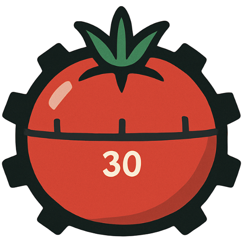

# Rusty Pomo

Minimalist, visually pleasing Pomodoro timer in your terminal. Built with Rust, Ratatui, and Crossterm.



### Features
- Configurable durations for focus, short break, and long break
- Simple, clean TUI with a progress gauge
- Three themes: `dracula`, `solarized-dark`, `gruvbox-dark`
- Desktop notifications with optional sound and custom duration
- macOS bundle-id support so notifications can use your app icon

### Prerequisites
- Rust toolchain: `rustup` + `cargo` (`rustc --version` should work)

### Run
```bash
cargo run
```

With custom options:
```bash
cargo run -- \
  --focus 50 --short 10 --long 20 --long-every 4 \
  --theme gruvbox-dark \
  --notification-sound Ping \
  --notification-seconds 15
```

Disable notifications:
```bash
cargo run -- --notifications=false
```

### Keybindings
- Space: pause/resume
- n: next phase
- r: reset current phase
- q or Esc: quit

### CLI options
```text
--focus <MIN>               Focus minutes (default: 25)
--short <MIN>               Short break minutes (default: 5)
--long <MIN>                Long break minutes (default: 15)
--long-every <N>            Number of focus sessions before a long break (default: 4)
--theme <THEME>             Theme (default: dracula)  [dracula, solarized-dark, gruvbox-dark]
--notifications <BOOL>      Enable desktop notifications (default: true)
--notification-sound <S>    Sound name (platform-specific)
--notification-seconds <S>  Notification duration in seconds (default: 10; macOS ignores)
--macos-bundle-id <ID>      macOS only: bundle identifier to attribute notifications to
```

Notes:
- Common macOS sounds include `Ping`, `Submarine`; on Linux, try `message-new-instant`.
- macOS ignores per-notification icons and timeouts; see section below for using your own app icon.

### macOS notifications with the rusty pomo icon
macOS will always use the icon of the app bundle posting the notification. To see the Rusty Pomo logo in notifications, bundle the app and pass the bundle identifier. Step-by-step instructions are in:

- docs: `docs/macos-notifications.md`
